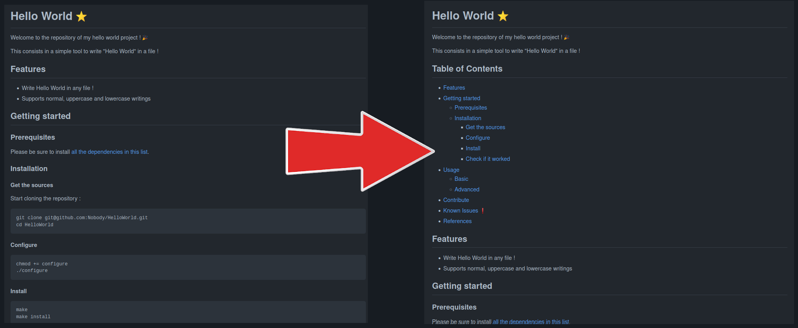

# Markdown Table of Contents (mdtoc) :bookmark_tabs:

[](https://scrutinizer-ci.com/g/Teskann/mdtoc/build-status/master)
[](https://scrutinizer-ci.com/g/Teskann/mdtoc/?branch=master)

Create tables of contents for your markdown files !



[](mdtoc)
#### Table of Contents

* [Features](#features)
* [Getting Started :computer:](#getting-started-computer)
	* [Prerequisites](#prerequisites)
	* [Installation](#installation)
* [Usage](#usage)
	* [Examples](#examples)
	* [Console Application Parameters](#console-application-parameters)
	* [Chose the place of the ToC in your file](#chose-the-place-of-the-toc-in-your-file)
* [Compatibility](#compatibility)
* [References](#references)
[](/mdtoc)

## Features

- :heavy_check_mark: Compatible with GitHub Markdown
- :heavy_check_mark: Supports multiple titles with the same name
- :heavy_check_mark: Supports special characters and emojis in titles
- :heavy_check_mark: Can be used recursively on multiple files
- :heavy_check_mark: Update current table of content if it exists
- :heavy_check_mark: Chose the maximum and minimum headers level
- :heavy_check_mark: Easy to use !

## Getting Started :computer:

### Prerequisites

You need :
- [Python](https://www.python.org/downloads/) (3.8+).
:snake:
- [make](https://www.gnu.org/software/make/) :hammer:

### Installation

```commandline
git clone https://github.com/Teskann/mdtoc
cd mdtoc
make
```

You can now use `mdtoc` as a console application ! :tada:

> :bulb: You don't need the source files anymore, delete them :
>```commandline
>cd .. && rm -rf mdtoc
>```

## Usage

### Examples

:point_right: [See examples here !](./examples) :point_left:

### Console Application Parameters

```
usage: mdtoc [-h] [-m MIN_DEPTH] [-M MAX_DEPTH] [-t TOC_TITLE] [-l TOC_LEVEL] [-p] [-v] [-r] input

Create tables of contents for your markdown files !

positional arguments:
  input                 Input file/directory. If you give a directory (with -r or not), mdtoc is
                        applied on all *.md files. If the input does not contain a mdtoc table of
                        content, it is created at the beginning of the file. If you wish to put
                        the ToC elsewhere, add a placeholder in your file (`[](mdtoc) ...
                        [](/mdtoc)`). If this placeholder is already in the file, all the content
                        between `[](mdtoc)` and `[](/mdtoc)` is replaced by the TOC.

optional arguments:
  -h, --help            show this help message and exit
  -m MIN_DEPTH, --min-depth MIN_DEPTH
                        Minimum heading level. If this is set to `None`, there is no minimum depth
                        applied. For example, if you set -m to `2`, all the headings with level <
                        2 will be ignored (such as `# Dummy Heading`). Default is None.
  -M MAX_DEPTH, --max-depth MAX_DEPTH
                        Maximum heading level. If this is set to `None`, there is no maximum depth
                        applied. For example, if you set -M to `3`, all the headings with level >
                        3 will be ignored (such as `#### Dummy Heading`). Default is None.
  -t TOC_TITLE, --toc-title TOC_TITLE
                        Title of the table of content part. Defaults to `Table of Contents`.
  -l TOC_LEVEL, --toc-level TOC_LEVEL
                        Heading level of the Table of content section. Defaults to 1.
  -p, --print           Do not overwrite the markdown file but print it with the table of content.
  -v, --verbose         List processed files verbosely.
  -r, --recursive
```

### Chose the place of the ToC in your file

If you run `mdtoc` on a file for the first time, the table of contents is
set at the beginning of the file. If you wish to put it elsewhere, add
placeholders `[](mdtoc)` and `[](/mdtoc)` in your file :

```markdown
# This is my title

This is the description of the file

[](mdtoc)  <-- Placeholder to indicate the beginning of the ToC
The table of content will be here !
Placeholder to indicate the end of the ToC -->  [](/mdtoc)

## Section 1

bla bla bla

...
```

If you run `mdtoc` on a file with a mdtoc Table of Content, it will be updated.

## Compatibility

If you get an issue running `mdtoc`, notice this has been developed under :

Software | Version
--- | ---
Operating System | Ubuntu `20.04`
Python | `3.8.8`
marko | `1.1.0`

## References

1. [Marko documentation (used to parse markdown files)](https://pypi.org/project/marko/)
2. [GitHub Guide : Mastering Markdown](https://guides.github.com/features/mastering-markdown/)
3. [Markdown Wikipedia](https://fr.wikipedia.org/wiki/Markdown)
4. [mdtoc documentation](https://teskann.github.io/mdtoc-documentation/)
